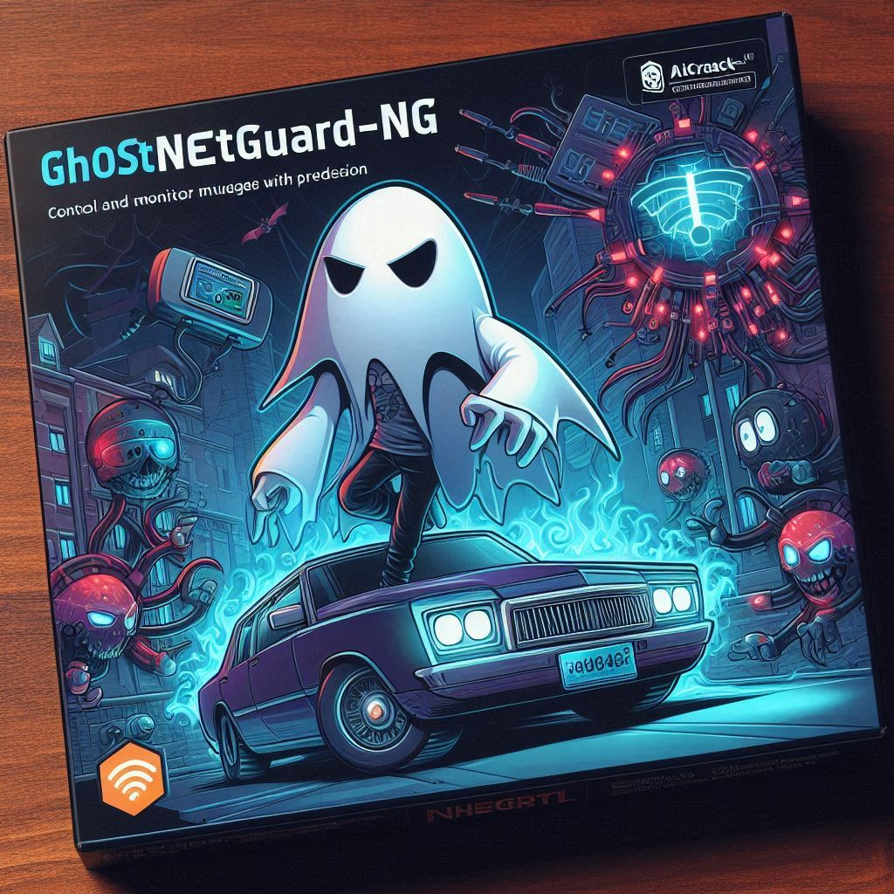
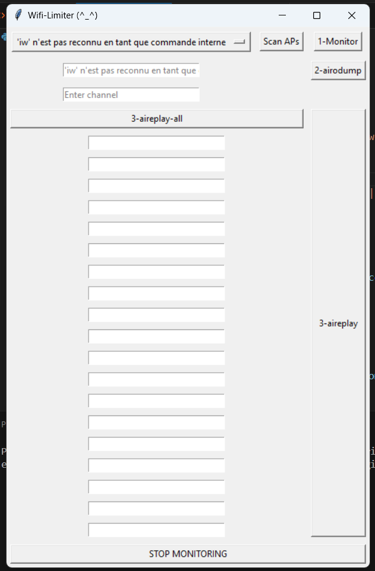

# 🌐 GhostNetGuard-NG 🚀



GhostNetGuard-NG is an advanced network management tool designed to control and monitor Wi-Fi usage with precision. Leveraging powerful components from the aircrack-ng suite, such as aireplay and airodump, this tool allows users to manage and limit network access effectively.

## ✨ Features
- 🕵️ **Monitor Wi-Fi Interfaces:** Detect available Wi-Fi interfaces and monitor their activities.
- 🔍 **Airodump-ng Integration:** Capture and analyze traffic from a specific BSSID and channel.
- 📡 **Aireplay-ng Attacks:** Launch deauthentication attacks to limit access or disconnect specific clients.
- 📊 **User-friendly Interface:** Intuitive GUI for easy control and monitoring of your network.
- 🔧 **Real-time Updates:** Dynamic updates of available Wi-Fi interfaces and live network details.

## 📷 Screenshot


## 🛠️ Requirements
Before running **GhostNetGuard-NG**, ensure you have the following dependencies installed:

- **Python 3.x** (with tkinter support)
- **aircrack-ng suite** (airmon-ng, aireplay-ng, airodump-ng)
- **nmcli** (for Wi-Fi scanning)
  
Install any missing Python packages using `pip`:
```bash
pip install tkinter
